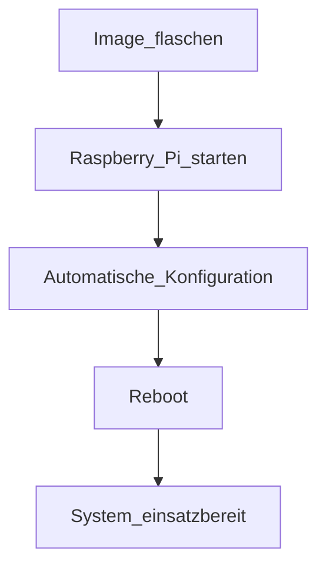

# DOITPi

**D**ev**O**ps **I**o**T** **Pi** – Raspberry Pi

[](https://github.com/kraeml/DOITPi/releases)
[](LICENSE)
[](https://github.com/kraeml/DOITPi/actions/workflows/main.yml)


DOITPi ist ein **Open-Source-Projekt**, das eine **vorgefertigte Sammlung von [DevOps](../../wiki/DevOps)-, [IoT](../../wiki/IoT)-Tools und [Robot Operating System 2 (ROS2)](../../wiki/ROS2)** als **sofort einsatzbereites Image** bereitstellt. Es basiert auf dem **[Raspberry Pi OS Lite](../../wiki/RaspbianOsLite)**. Das Projekt bietet ein **fertiges Image**, das die [Installation](../../wiki/Installation) und Einrichtung der Tools **vollautomatisch** übernimmt – **ohne manuelle Schritte**

**📥 [Aktuelles Image herunterladen](https://github.com/kraeml/DOITPi/releases/latest)**

---

## Zielgruppe

Bildungseinrichtungen, Entwickler:innen und Lernende, die **DevOps-Praktiken und IoT-Anwendungen** auf dem Raspberry Pi umsetzen möchten.

## Zugangsoptionen

DOITPi bietet flexible Zugriffsmöglichkeiten für verschiedene Einsatzszenarien:

- **🌐 Browser (Weboberfläche)**
  - **[CodeServer](../../wiki/Codeserver)**: VS Code im Browser – ideal für Remote-Entwicklung.
  - **[Node-RED](../../wiki/NodeRed)**: Visuelle Programmierung für IoT und ROS2.

- **🖥️ SSH (Headless-Betrieb)**

  Direkter Zugriff über die Kommandozeile (Standard-Port: `22`).

- **📶 Auto-Hotspot (falls kein WLAN verfügbar)**

  DOITPi aktiviert **automatisch einen Access Point**, wenn **keine bekannte WLAN-Verbindung** gefunden wird.
  - **SSID:** `AP-<HOSTNAME>` (z. B. `AP-doitpi-abc123`)
  - **Standard-Passphrase:** `123456789` *(**Hinweis:** Ändere dieses Passwort nach der ersten Einrichtung!)*
  - **Zweck:** Ermöglicht eine **sofortige Verbindung** für die Erstkonfiguration oder in Umgebungen ohne WLAN.
  - **Sicherheit:**
    > ⚠️ **Wichtig:**
    > - Der Auto-Hotspot ist **nur aktiv**, wenn kein bekanntes WLAN verfügbar ist.
    > - Das **Standard-Passwort** ist unsicher und sollte **sofort geändert** werden (siehe [Wiki: Hotspot konfigurieren](../../wiki/Hotspot)).
    > - Für den **Dauerbetrieb** empfiehlt sich die Nutzung eines **gesicherten WLANs** oder VPNs.

---

### **🔹 Warum ein Auto-Hotspot?**
- **Plug & Play:** Keine manuelle Netzwerkkonfiguration nötig – ideal für **Bildungseinrichtungen** oder Workshops.
- **Fallback-Lösung:** Garantiert Zugriff auf das System, selbst wenn kein WLAN verfügbar ist.
- **Einfache Erstinbetriebnahme:** Nutzer:innen können sich **sofort verbinden** und die Einrichtung abschließen.

---

## Ziel: Sofort einsatzbereit

DOITPi liefert ein **vollständig vorinstalliertes Image** für den Raspberry Pi.

- **Keine manuelle Installation nötig:** Alle Tools (DevOps, IoT, ROS2) sind **bereits integriert** und konfiguriert.
- **Schnelle Inbetriebnahme:**
  - Image auf die SD-Karte flashen.
  - Raspberry Pi starten.
  - **Nach ~10 Minuten (ja nach Hardware) und einem Reboot** ist das System **einsatzbereit** – ohne weitere Schritte!

> 💡 **Warum "vollautomatisch"?**
> - **Kein Herunterladen oder Installieren** von Paketen nötig.
> - **Keine komplexen Konfigurationen** – alles ist vorab eingerichtet.
> - Ideal für **Bildungseinrichtungen**, Workshops oder schnelle Prototypen.

---

### 🔧 Was passiert im Hintergrund?

1. **Erststart:**
   - Das System bootet und führt **automatische Konfigurationen** durch.
   - **Auto-Hotspot** wird aktiviert (falls kein WLAN verfügbar).
2. **Reboot (~10 Minuten später):**
   - Alle Dienste (CodeServer, Node-RED, ROS2, etc.) sind **startbereit**.
   - Zugriff über **Browser, SSH oder Hotspot** möglich.



---

### Wichtige Hinweise für Nutzer:innen

- **Erstkonfiguration:**
  - Nach dem ersten Reboot **Passwörter ändern** (Hotspot, SSH – siehe [Sicherheitshinweise](../../wiki/Autohotspot).
  - Optional: **WLAN einrichten** (falls der Hotspot nicht mehr benötigt wird).
- **Updates:**
  - DOITPi bleibt **up-to-date** durch regelmäßige Image-Releases.
  - Aktualisierungen können über `sudo apt update && sudo apt upgrade` installiert werden.

---

## **Technische Basis**

DOITPi basiert auf **[CustomPiOS](https://github.com/guysoft/CustomPiOS)** – einem Framework zum Erstellen **eigener Raspberry Pi-Distributionen**. 📖 **[Was ist CustomPiOS?](../../wiki/CustomPiOS-–-Eigene-Raspberry‐Pi‐Distributionen-leicht-gebaut)**

DOITPi wird **kontinuierlich weiterentwickelt** und bietet eine **modulare, anpassbare Umgebung** für DevOps- und IoT-Projekte.

---

## Themenbereiche

DOITPi deckt folgende Themen ab:

| **Systemadministration** | **Netzwerk** | **Elektrotechnik** | **Programmierung** |
|--------------------------|--------------|--------------------|---------------------|
| Linux-Konfiguration      | LAN/WLAN     | Schaltungen        | Microcontroller     |
| Automatisierung          | VPN/Proxy    | Sensoren           | Python, Bash, YAML  |
| Headless-Setup           | Firewall     | Aktoren            | Python, Bash, YAML          |

---

## DevOps-Tools

DOITPi integriert folgende DevOps-Lösungen:

| Tool               | Beschreibung                                                                                     |
|--------------------|-------------------------------------------------------------------------------------------------|
| **[Ansible](https://docs.ansible.com/)** | Automatisierte Systemkonfiguration und Softwarebereitstellung (CI/CD, rollierende Updates).     |
| **[Testinfra](https://testinfra.readthedocs.io/)** | Python-basierte Unit-Tests für Serverzustände (kompatibel mit Ansible, Puppet, Chef).             |
| **[Code-Server](https://github.com/coder/code-server)** | VS Code im Browser – ideal für Remote-Entwicklung.                                               |
| **[Etckeeper](https://manpages.debian.org/etckeeper)** | Versionskontrolle für `/etc`-Konfigurationen.                                                   |
| **LXC/Docker**     | Containerisierung für isolierte Umgebungen.                                                     |
| **Git/GitOps**     | Versionskontrolle und deklarative Infrastruktur.                                                |

---

## IoT-Tools

DOITPi unterstützt IoT-Projekte mit folgenden Komponenten:

| Tool                     | Beschreibung                                                                                     |
|--------------------------|--------------------------------------------------------------------------------------------------|
| **[IOTstack](https://sensorsiot.github.io/IOTstack/)** | Docker-Compose-Templates für IoT-Stacks (z. B. MQTT, Datenbanken).                              |
| **[Node-RED](https://nodered.org/)** | Low-Code-Tool zur Verbindung von Hardware, APIs und Dienste.                        |
| **[Heimdall](https://heimdall.site/)** | Dashboard für Webanwendungen und Links.                                           |
| **[Mosquitto](https://mosquitto.org/)** | MQTT-Broker (v5.0, v3.1.1) für leichte IoT-Kommunikation.                        |
| **Monitoring**           | Telegraf, InfluxDB, Grafana, Prometheus für Echtzeitdaten.                                      |
| **PlatformIO**           | Unterstützung für Arduino, ESP32, RP2040.                                                       |
| **[ESPHome](https://esphome.io/)** | YAML-basierte Steuerung von ESP8266/ESP32-Geräten.                                    |

## Robotik-Tools

DOITPi integriert ROS2 für Robotik- und IoT-Projekte:

| Tool               | Beschreibung                                                                                     |
|--------------------|-------------------------------------------------------------------------------------------------|
| **[ROS2](https://docs.ros.org/)** | Framework für Robotik, das Kommunikation zwischen Knoten ermöglicht. Ideal für Echtzeitdatenverarbeitung, Sensorintegration und Algorithmen wie SLAM oder Pfadplanung. Voll kompatibel mit Raspberry Pi und Docker, und integrierbar mit Node-RED und Webots. |
|**Node-RED** | Flow-basierte Automatisierungsplattform. Ermöglicht visuelle Programmierung ohne tiefgehende Code-Kenntnisse. Unterstützt ROS2-Integration für Robotik-Projekte. Ideal für die Steuerung von IoT-Geräten und schnelle Prototypen. |
| **[Webots](https://cyberbotics.com)** | 3D-Robotersimulationssoftware für Forschung und Bildung. Bietet eine realistische Physik-Engine und unterstützt ROS2. Perfekt zum Testen von Algorithmen für autonome Roboter oder IoT-Systeme vor der Implementierung auf echter Hardware. |

---

## Raspberry Pi-Features

DOITPi optimiert den Raspberry Pi für folgende Anwendungen:

| Bereich          | Tools/Technologien                                                                              |
|------------------|-------------------------------------------------------------------------------------------------|
| **Netzwerk**    | LAN/WLAN, Hotspot, VPN (P2P), Reverse Proxy, Let’s Encrypt                                       |
| **Headless**     | SSH, Webdienste                                                                                 |
| **Backup**       | Automatisierte Sicherungen                                                                      |
| **Stromversorgung** | USB-C PD, Powerbank, USV                                                                     |
| **GPIO**         | I²C-Setup, node-red, [Blockly-gPIO](https://github.com/GrazerComputerClub/Blockly-gPIo)         |

---

## Programmiersprachen & DSLs

DOITPi unterstützt folgende Sprachen und Domänenspezifische Sprachen (DSLs):

- **Python** ([JupyterLab](http://jupyter.org/), virtualenv)
- **Bash** (Skripte für Automatisierung)
- **YAML** (Konfigurationen für IoT/DevOps)
- **C++** (Hauptsprache für **ROS2**)
- **Golang, Ruby (inspec.io), JavaScript (Node-RED)**

---

## Low-Code-Tools

Für schnelle Prototypen und Bildungskontexte:

- **Blockly/Scratch** (visuelle Programmierung)
- **Node-RED** (Flow-basierte Automatisierung)
- **YAML** (deklarative Konfigurationen)

---

## Mitentwickeln?

✅ **Ja!** DOITPi ist ein **Community-Projekt** – Beiträge sind willkommen!

### Anforderungen

- `qemu-arm-static`
- [CustomPiOS](https://github.com/guysoft/CustomPiOS)
- Raspbian-Image (heruntergeladen)
- Root-Rechte für `chroot`
- Bash, Git, Sudo

### Build-Anleitung (Debian/Ubuntu/Raspbian)

1. Abhängigkeiten installieren:

   ```bash
   sudo apt-get install gawk util-linux qemu-user-static git p7zip-full python3 coreutils
   ```

2. Repositories klonen:

   ```bash
   git clone https://github.com/guysoft/CustomPiOS.git
   git clone https://github.com/kraeml/DOITPi.git
   ```

3. Image herunterladen und bauen:

   ```bash
   cd DOITPi/src/image
   wget -c --trust-server-names 'https://downloads.raspberrypi.org/raspios_lite_armhf_latest'
   cd ../image-raspios_lite_arm64
   wget -c --trust-server-names 'https://downloads.raspberrypi.org/raspios_lite_arm64_latest'
   cd ..
   ../../CustomPiOS/src/update-custompios-paths
   sudo modprobe loop
   sudo make build_arm64
   ```

### Build mit Vagrant

Für automatisierte Builds in einer VM:

1. Vagrant + VirtualBox installieren:

   ```bash
   sudo apt-get install vagrant nfs-kernel-server virtualbox
   sudo vagrant plugin install vagrant-nfs_guest
   sudo modprobe nfs
   ```

2. DOITPi-Vagrant-Konfiguration nutzen:

   ```bash
   cd DOITPi/src/vagrant
   sudo vagrant up
   ./run_vagrant_build.sh
   ```

3. **Optionale Varianten:**

   ```bash
   ./run_vagrant_build.sh [VARIANTE]
   ```

---

**Fragen oder Ideen?** Öffne ein Issue auf [GitHub](https://github.com/kraeml/doitpi) oder trage direkt bei!

---

## Lizenz

DOITPi steht unter der [MIT-Lizenz](LICENSE).

### Lizenzen Dritter

DOITPi nutzt die folgenden Tools und Bibliotheken:

| Tool          | Lizenz                     | Quelle                                  |
|---------------|----------------------------|-----------------------------------------|
| ROS2          | Apache 2.0                 | [docs.ros.org](https://docs.ros.org/)   |
| Node-RED      | Apache 2.0                 | [nodered.org](https://nodered.org/)     |
| Ansible       | GPLv3                      | [ansible.com](https://www.ansible.com/)|
| CustomPiOS    | MIT                        | [GitHub](https://github.com/guysoft/CustomPiOS) |

---

## 📦 Abhängigkeiten & Danksagungen

DOITPi steht auf den Schultern von Riesen. Besonderer Dank gilt:

- **[Raspberry Pi OS](https://www.raspberrypi.com/software/)** (Basis-System)
- **[CustomPiOS](https://github.com/guysoft/CustomPiOS)** (Image-Erstellung)
- **[NetworkManager](https://networkmanager.dev/)** (Auto-Hotspot-Funktion)
- **[ROS2](https://docs.ros.org/)** & **[Node-RED](https://nodered.org/)** (Robotik & IoT)
- **[Ansible](https://www.ansible.com/)** (Automatisierung)
- **Allen Mitwirkenden** ([GitHub Contributors](https://github.com/kraeml/DOITPi/graphs/contributors))!

💙 **Möchtest du hier auftauchen?** Trage bei und sende einen Pull Request!
